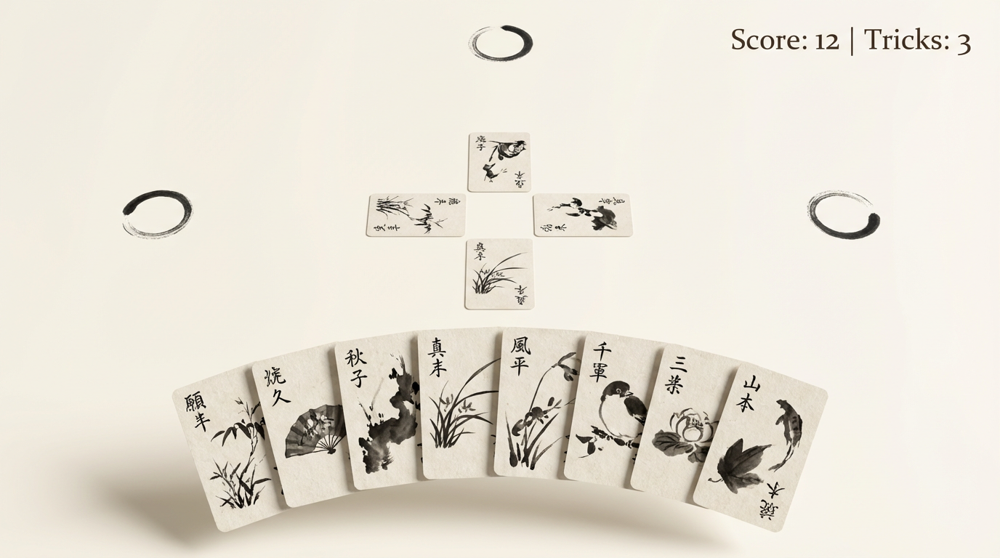

# Zen Minimalist Theme Guide

This document defines the visual language for the 28 card game UI. Use this as a reference when generating mockups, assets, or implementing new features.



---

## Core Philosophy

**Inspired by**: Japanese sumi-e (ink wash painting), wabi-sabi aesthetics, zen gardens

**Principles**:
- **Ma (間)** — Embrace negative space; let elements breathe
- **Simplicity** — Remove the unnecessary; every element must serve a purpose
- **Organic imperfection** — Hand-drawn qualities over digital precision
- **Tranquility** — Calm, meditative atmosphere; no visual noise

---

## Color Palette

| Name | Hex | Usage |
|------|-----|-------|
| **Cream** | `#FAF8F5` | Primary background |
| **Warm White** | `#F5F2ED` | Card face background |
| **Ink Black** | `#1A1A1A` | Primary text, brush strokes |
| **Charcoal** | `#3D3D3D` | Secondary text, subtle details |
| **Shadow** | `rgba(0,0,0,0.08)` | Soft drop shadows |

**Restrictions**:
- No saturated colors
- No gradients (except subtle shadows)
- No pure white (`#FFFFFF`) — always use warm cream tones

---

## Typography

| Element | Style |
|---------|-------|
| **Score/UI Text** | Serif font (e.g., Garamond, Palatino), regular weight |
| **Card Values** | Brush stroke style, slightly irregular |
| **Size Hierarchy** | Minimal variation; UI text should be understated |

**Format**: `Score: 12 | Tricks: 3` — clean, separated by pipe character

---

## Cards

### Card Face
- **Background**: Warm white/cream with subtle paper texture (washi)
- **Art Style**: Black ink brush illustrations (sumi-e)
- **Suit Symbols**: Simplified, brush-stroke versions of ♥ ♦ ♣ ♠
- **Rank Display**: Hand-drawn calligraphy style numerals/letters
- **Corners**: Slightly rounded (2-4px radius feel)
- **No borders** — cards defined by shadow only

### Card Back
- **Design**: Single enso circle (開) centered
- **Background**: Same cream/washi texture as face
- **Stroke**: Organic, open circle with visible brush start/end

### Card Shadows
- **Type**: Soft drop shadow, no hard edges
- **Offset**: Slight downward (y+4px equivalent)
- **Blur**: Large radius for diffuse effect
- **Color**: `rgba(0,0,0,0.08)` to `rgba(0,0,0,0.12)`

---

## Layout

### Spatial Organization
```
┌─────────────────────────────────────────────┐
│                                   [Score]   │  ← Top right, minimal UI
│                                             │
│           ○                   ○             │  ← Opponent markers (enso)
│                                             │
│                 ┌───┐ ┌───┐                 │
│           ┌───┐ │   │ │   │ ┌───┐           │  ← Play area (cross pattern)
│           │   │ └───┘ └───┘ │   │           │
│           └───┘             └───┘           │
│                 ┌───┐                       │
│                 │   │                       │
│                 └───┘                       │
│                                             │
│     ┌─┬─┬─┬─┬─┬─┬─┬─┐                       │  ← Player hand (fan arc)
│     │ │ │ │ │ │ │ │ │                       │
│     └─┴─┴─┴─┴─┴─┴─┴─┘                       │
│           ~~~~~~~~~~~~                      │  ← Soft arc shadow
└─────────────────────────────────────────────┘
```

### Player Hand
- **Arrangement**: Fan/arc layout, cards overlap slightly
- **Position**: Bottom center of screen
- **Tilt**: Cards at edges tilted outward (±15°)
- **Shadow**: Single unified shadow under entire hand arc

### Play Area
- **Position**: Center of screen
- **Layout**: Cross/diamond pattern for 4-player trick
- **Spacing**: Cards don't touch; maintain breathing room

### Opponent Markers
- **Symbol**: Enso circle (brush stroke)
- **Position**: Left and right sides of play area
- **Size**: ~15% of card height
- **Animation**: Gentle pulse/breathe when active turn

---

## Visual Effects

### Allowed
- Soft drop shadows
- Subtle scale animations (hover, select)
- Gentle opacity fades
- Slow, eased transitions (300-500ms)

### Not Allowed
- Glow effects
- Particle systems
- Sharp animations or bounces
- Blur effects (except shadow)
- Any neon or bright colors

---

## Lighting (3D Implementation)

| Property | Value |
|----------|-------|
| **Ambient Light** | Soft white, intensity 0.8-1.0 |
| **Directional Light** | None or very subtle |
| **Shadows** | Soft shadow mapping, low intensity |
| **Background** | Solid `#FAF8F5`, no gradient/fog |

---

## Animation Guidelines

| Action | Animation |
|--------|-----------|
| **Card Hover** | Lift 5%, subtle scale 1.02 |
| **Card Select** | Lift 10%, gentle float |
| **Card Play** | Smooth slide to position, 400ms ease-out |
| **Turn Indicator** | Enso marker pulses (scale 1.0 → 1.05 → 1.0), 2s cycle |
| **Trick Complete** | Cards fade/slide off, 500ms |

**Easing**: Always use ease-out or ease-in-out; never linear or bounce

---

## Prompt Template for Generating Assets

When using AI image generation, include these keywords:

```
Japanese sumi-e ink brush style, minimalist zen aesthetic, 
cream/off-white background (#FAF8F5), black ink only, 
washi paper texture, hand-painted calligraphy, 
soft drop shadows, lots of negative space, 
no borders, no bright colors, tranquil meditative atmosphere
```

---

## File References

| Asset | Path |
|-------|------|
| Card sprite sheet | `public/textures/zen-cards-sprite.png` |
| Card back | `public/textures/zen-card-back.png` |
| Opponent marker | `public/textures/enso-marker.png` |
| Reference mockup | `public/textures/zen-mockup-reference.png` |
